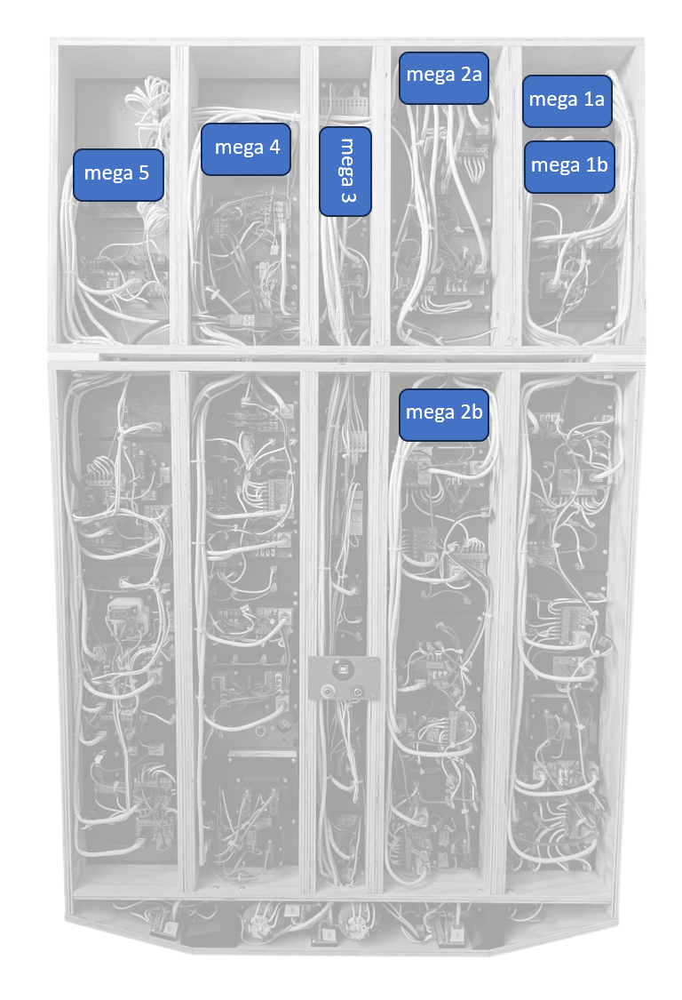
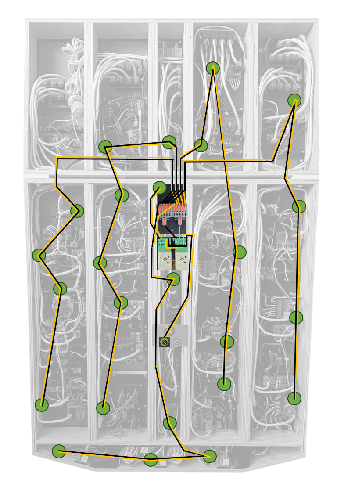
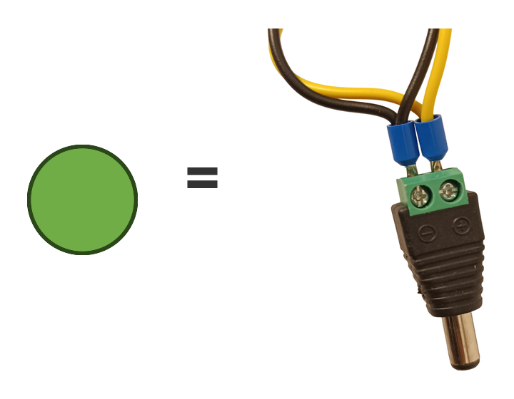
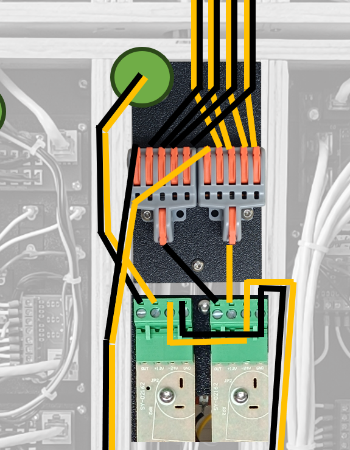
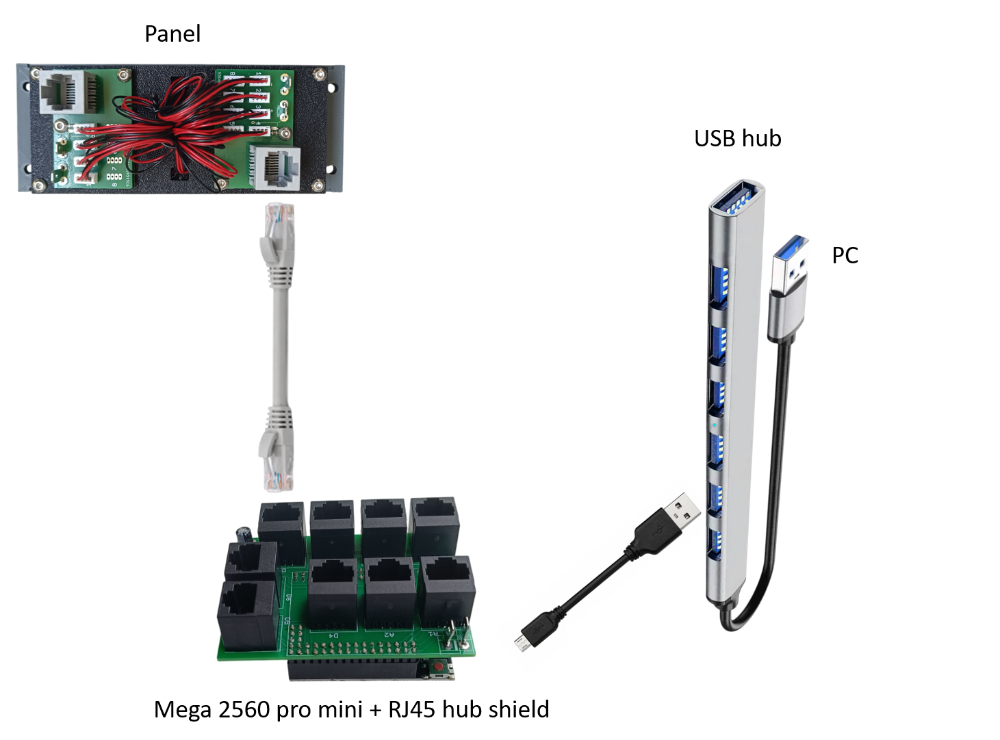

# System Overview

How the overhead panel connects to the simulator.

[← Back to main page](../README.md)

---

## The Idea

All electronics are enclosed inside the panel and connected to an internal USB hub, so the finished panel needs just **one USB cable to the PC** for all data. Power is supplied separately — see [Power supply](#power-supply) below.

---

## Software (PC side)

| Component | Role |
|---|---|
| **Microsoft Flight Simulator 2020** | The simulator itself |
| **PMDG 737-800** | Aircraft model that exposes the real 737 systems and variables |
| **MobiFlight** | Bridges the hardware and the simulator — maps each switch, button and LED to a PMDG variable |

MobiFlight does the heavy lifting: switches and LEDs are configured in its graphical interface, so **no programming is required**. The boards run the standard MobiFlight firmware, which MobiFlight uploads for you when the board is first added.

The complete configuration — the board definitions and the mapping for every switch, button and LED — is published here: **[MobiFlight Configuration →](mobiflight.md)**

---

## Hardware (inside the panel)

| Component | Qty | Purpose | Reference |
|---|---:|---|---|
| **USB hub** | 1× | Connects all seven boards to the single USB cable. 7 ports, USB 3.0 | [Product I used](../images/parts/AE_usb_hub.png) |
| **USB cable** | 7× | Board to hub. USB-A to micro USB, 1 m; sold in packs — I bought 10 and used 7 | [Product I used](../images/parts/AE_usb_cable.png) |
| **MEGA 2560 PRO MINI** | 7× | Each board drives one group of panels. 5 V (embed), CH340G, ATmega2560-16AU; supplied with the male pin headers | [Product I used](../images/parts/AE_mega.png) |
| **RJ45 Hub Shield PCBs** | 7× | One per board — brings nine RJ45 sockets to the Mega 2560 | [PCB docs](pcb/rj45-hub-shield.md) |
| **Panels** | — | The overhead panels themselves. Each connects to a board with one or more Ethernet patch cables; new ones are released over time | [Models](models/README.md) |

Each Mega 2560 is registered in MobiFlight as a separate device, which keeps the configuration manageable and makes it easy to work on one section of the overhead at a time.

### The boards

The project uses **MEGA 2560 PRO MINI** boards — inexpensive third-party clones widely sold on AliExpress. They are built around the same **ATmega2560** microcontroller as the official Arduino Mega 2560 and behave identically, but they are *not* genuine Arduino products.

The **PRO MINI** form factor is what matters here: the board is a fraction of the size of a full Mega 2560 while keeping the full pin count, so all seven fit inside the overhead panel.

Where the seven boards sit inside my panel, each with its RJ45 Hub Shield. Which board and which socket a panel connects to is in the **Wiring** section of that panel's [model page](models/README.md).

---

### Power supply

The panel does **not** draw its power from the USB cable. It is fed by **two separate external power supplies**:

| Supply | Powers |
|---|---|
| **12 V** | Panel backlighting and the flood light |
| **5 V** | All other electronics — the Mega boards, annunciator LEDs, servos, displays |

The USB cable therefore carries data only. This keeps the load off the PC's USB port, which matters with 125 annunciators in the finished panel.

#### 12 V

The 12 V rail feeds the panel lighting only. It enters through a **DC socket on the back of the panel**, next to the 5 V socket and the USB connector, and goes first to two PWM dimmers:

| Dimmer | Controls |
|---|---|
| **Backlight** | The brightness of the whole overhead backlight |
| **Flood light** | The overhead flood light |

Both are ordinary PWM LED dimmers taken out of their housings. The board **and** its potentiometer are reused from each, so the two knobs on the Center Middle Panel are the original dimmer potentiometers; the two boards sit on the plate behind that panel. On the real aircraft the second knob sets the brightness of the circuit breaker panel, and the flood light is controlled from a panel outside the overhead — it drives the flood light here so that the knob and its dimmer are put to use.

> DC socket → **backlight dimmer** → **splice connectors** → **five branches**, one per column of panels → **DC plug** on each backlit panel

The backlight dimmer feeds a pair of lever-type splice connectors, one lever in and five out on each: one connector carries **+12 V** (yellow), the other **GND** (black). They are screwed to the back of the [Flood Light](models/18-flood-light.md) panel. The five branches that leave them each feed one column of panels. The flood light dimmer feeds the flood light directly, on a connector of its own.

The 12 V distribution drawn over a photo of the panel from behind. Yellow is +12 V, black GND.

Every backlit panel takes its 12 V through a **DC plug with a screw terminal**, and so does the flood light. Each green circle on the drawing is one of these — there are **25** of them in the panel.

The middle of the drawing close up: the two splice connectors on top and the two dimmer boards below — flood light on the left, backlight on the right.

---

### Connection to panels

Panels attach to the boards through RJ45 connectors, using standard Ethernet patch cables. Three PCB variants cover the different needs:

- **RJ45 Direct** — buttons, toggle switches, rotary switches, servos, displays
- **RJ45 LED Driver** — up to 8 annunciators; the ULN2803 driver powers the LEDs so the board is not overloaded
- **RJ45 Combined** — 4 driven annunciator channels + 4 direct connections

At the board end the cables plug into an **RJ45 Hub Shield** — a shield that sits on top of the Mega 2560 PRO MINI and brings nine RJ45 sockets to it, so no panel cable has to be wired to the board pin by pin.

The chain for a single connection: panel PCB → Ethernet patch cable → MEGA 2560 PRO MINI with the RJ45 Hub Shield → micro USB cable → USB hub → PC. A panel may need more than one cable, and one board takes up to nine.

See [PCB Manufacturing Files](pcb/README.md) for details, BOM and wiring.

---

## 🚧 To be documented

This section is still to be written:

- **Power supply details** — current rating of each supply, and how the 5 V is distributed inside the panel
