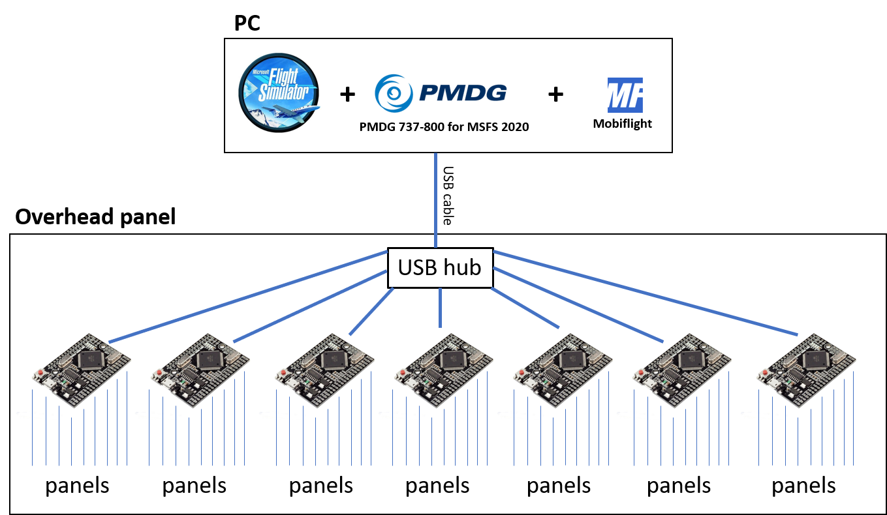

# System Overview

How the overhead panel connects to the simulator.

[← Back to main page](../README.md)

---

## The Idea

All electronics are enclosed inside the panel and connected to an internal USB hub, so the finished panel needs just **one USB cable to the PC** for all data. Power is supplied separately — see [Power supply](#power-supply) below.

---

## Software (PC side)

| Component | Role |
|---|---|
| **Microsoft Flight Simulator 2020** | The simulator itself |
| **PMDG 737-800** | Aircraft model that exposes the real 737 systems and variables |
| **MobiFlight** | Bridges the hardware and the simulator — maps each switch, button and LED to a PMDG variable |

MobiFlight does the heavy lifting: switches and LEDs are configured in its graphical interface, so **no programming is required**. The boards run the standard MobiFlight firmware, which MobiFlight uploads for you when the board is first added.

> **Coming soon**
> The MobiFlight configuration files for the whole overhead panel will be published in this repository.

---

## Hardware (inside the panel)

| Component | Quantity | Purpose |
|---|---|---|
| **Mega 2560 PRO MINI** | 7× | Each board drives one group of panels |
| **USB hub** | 1× | Connects all seven boards to the single USB cable |
| **External power supplies** | 2× | One 12 V unit for the backlighting, one 5 V unit for the electronics |
| **RJ45 breakout PCBs** | 53× | Link the individual panels to the boards — see [PCB documentation](pcb/README.md) |
| **RJ45 Hub Shield PCBs** | 7× | One per board — brings nine RJ45 sockets to the Mega 2560 |

Each Mega 2560 is registered in MobiFlight as a separate device, which keeps the configuration manageable and makes it easy to work on one section of the overhead at a time.

### The boards

The project uses **MEGA 2560 PRO MINI** boards — inexpensive third-party clones widely sold on AliExpress. They are built around the same **ATmega2560** microcontroller as the official Arduino Mega 2560 and behave identically, but they are *not* genuine Arduino products.

The **PRO MINI** form factor is what matters here: the board is a fraction of the size of a full Mega 2560 while keeping the full pin count, so all seven fit inside the overhead panel.

### What to order

| Qty | Part | Reference |
|---:|---|---|
| 7× | **MEGA 2560 PRO MINI** — 5 V (embed), CH340G, ATmega2560-16AU; supplied with the male pin headers | [Product I used](../images/parts/AE_mega.png) |
| 1× | **USB hub** — 7 ports, USB 3.0; one port per board | [Product I used](../images/parts/AE_usb_hub.png) |
| 7× | **USB cable** — USB-A to micro USB, 1 m; connects each board to the hub. Sold in packs — I bought 10 and used 7 | [Product I used](../images/parts/AE_usb_cable.png) |

---

### Power supply

The panel does **not** draw its power from the USB cable. It is fed by **two separate external power supplies**:

| Supply | Powers |
|---|---|
| **12 V** | Panel backlighting |
| **5 V** | All other electronics — the Mega boards, annunciator LEDs, servos, displays |

The USB cable therefore carries data only. This keeps the load off the PC's USB port, which matters with 125 annunciators in the finished panel.

---

### Connection to panels

Panels attach to the boards through RJ45 connectors, using standard Ethernet patch cables. Three PCB variants cover the different needs:

- **RJ45 Direct** — buttons, toggle switches, rotary switches, servos, displays
- **RJ45 LED Driver** — up to 8 annunciators; the ULN2803 driver powers the LEDs so the board is not overloaded
- **RJ45 Combined** — 4 driven annunciator channels + 4 direct connections

At the board end the cables plug into an **RJ45 Hub Shield** — a shield that sits on top of the Mega 2560 PRO MINI and brings nine RJ45 sockets to it, so no panel cable has to be wired to the board pin by pin.

See [PCB Manufacturing Files](pcb/README.md) for details, BOM and wiring.

---

## 🚧 To be documented

These sections are still to be written:

- **Power supply details** — current rating of each supply, and how power is distributed inside the panel
- **Board assignment** — which panels are connected to which Mega 2560
- **MobiFlight configuration** — the complete configuration files will be published here
